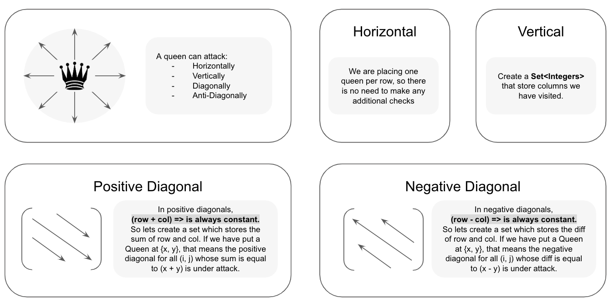

# 51. N QUEENS

* Question: https://leetcode.com/problems/n-queens/
* Solution: [here](Solution.java)
* Testing: [here](SolutionTest.java)
* Tags: #backtrack
* Complexity: Time: O(n!), Space: O(1)

---

## Logic:

Conclusions from above explanation:

* Row ∈ [0, n]
* Col ∈ [0, n]
* Positive diagonal ∈ [0, 2n]
* Negative diagonal ∈ [-n, n], for simplicity lets add the board size to make it similar to positive diagonal.
* => Negative diagonal ∈ [0, 2n]

The given solution has a runtime complexity of `O(n!)` and a space complexity of `O(n)`. However, to optimize the space
further, a `bitMap` can be used instead of a `set`, resulting in a constant space complexity of `O(1)`.

---

## Implementation

The solution is implemented in Java, using a recursive backtracking approach. The main logic is implemented in the
`solveNQueens` method, which takes an integer n as input and returns a list of all possible solutions as a list of lists
of strings.

The `helper` method is a recursive helper function that is called internally by solveNQueens. It performs the
backtracking process, iterating through all possible positions and checking if it's safe to place a queen in that
position.

The `isSafe` method is a helper function that checks if a given position is safe for placing a queen based on the
current board state.

The `createBoard` method is used to generate the board representation for a valid solution, where 'Q' represents a queen
and '.' represents an empty cell.
